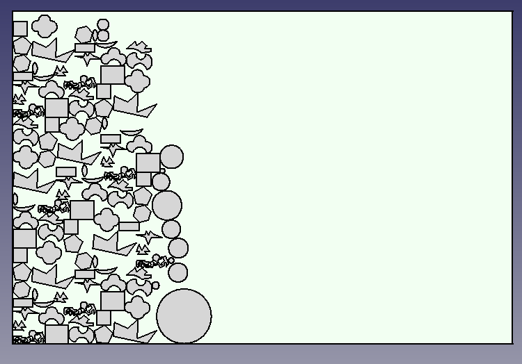

# 用于激光切割的模块

***使用以下命令安装我们的库：***  

 > pip install nestle-mynest  

这个仓库中包含了激光切割需要的某些模块。代码完全是用 Python 编写的。
以下是目前提供的模块：
**1. 形状的形成**  
**2. 从 .DXF 和 .svg 文件中或者任意图片文件格式（.png, .jpeg 或者 .tiff）**  
**3. 形状排料**  
以下是未来添加的模块：
**4. 路径规划和导入与导出选项**  
**5. 激光切割机器代码的转换**  

## **简介**  
###  __1. 形状的形成:__   
> i) 形状的维度将在代码中定义。  
> ii) 代码通过简单的数学计算形成形状，并且以坐标的形式输出。

### __2. 处理.DXF文件:__   
> i) 通过检测拆线、直线、圆弧、圆等单个实体来提取图形文件中的形状。
> ii) 通过形状的几何计算提取坐标。

### __3. 从 .svg 文件或者任意图形文件格式（.png, .jpeg 或者 .tiff）中提取形状__  
> i) 提供图像作为输入，利用代码检测形状。如果文件是“.svg”格式，首先转换为“.png”格式。使用 Canny算子检测形状的边缘。
> ii) 从图片中检测到形状后，从检测到的形状中提取坐标。

### __4. 形状排样:__  
> i) 一旦我们提供了输入形状的坐标，形状就会被自动排样。更多关于排样的信息可以参考下面给出的流程图。
> ii) 排样是下面方法的混合:  
a) 左底（Bottom-Left，BL）算法 b) DJD 启发式算法（Djang and Finch,
1998）  

__这些排样形状的图片来自于绘图文件（.DXF）:__  

__这里排样形状的图片来自于其他图片:__   

__这些是在输入图像的情况下描述检测图像的轮廓:__  

### 目前创建的模块的流程图:  

__1)提取坐标和/或创建形状的流程图:__    

__2)从图像文件中提取坐标用于排料的流程图:__  

__3) 从图像中提取坐标用于轮廓检测的流程图:__  

__注意:__ 要正确使用排料模块需要安装以下软件包: 1. ezDXF 2. cv2 3. matplotlib 4.svglib 5.reportlab 6.math 7.time  

To-do 列表:  
1. 通过添加更多距离函数优化排料  
2. 创建排料代码的库
